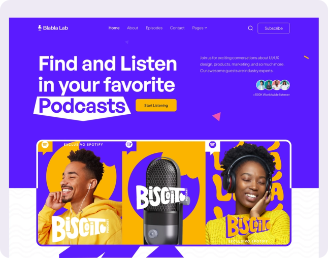

# Network — Modern Landing Page

A high-performance, fully responsive landing page built with modern HTML5, CSS3, and Vanilla JavaScript.

 <!-- Update this path with a screenshot of the project if desired -->

## 📖 Origin Story & Disclaimer

**Disclaimer:** _This is not a real agency website and is not affiliated with any company. The design was sourced online for educational purposes._

I originally built this project entirely from scratch when I was 16 years old. With no mentors, frameworks, or AI assistance, I spent two weeks manually writing every line of HTML and CSS to replicate a design I found online. The goal was purely to practice and push my fundamental front-end coding skills.

Recently, I revisited this "ancient" codebase to refactor and modernize it, transforming it from a raw teenage practice project into a professional, portfolio-grade application that adheres to modern web standards.

## 🛠 The Refactoring Journey

The original codebase was a testament to raw effort—functional, but weighed down by technical debt (over 2,000 lines of CSS across 8 files, hard-coded pixel widths, and repetitive media queries). The recent modernization sprint completely overhauled the architecture:

### Before (The 16-Year-Old Era)

- **CSS:** 8 disjointed stylesheets, heavy reliance on `!important`, and hard-coded `1440px` widths.
- **HTML:** Non-semantic structure, missing accessibility tags, and invalid element nesting.
- **JavaScript:** Bulky polyfills for smooth scrolling and complex DOM manipulation for simple toggles.

### After (The Modern Era)

- **Architecture:** Consolidated into a 2-file CSS system (`tokens.css` for a centralized design system and `main.css` for layouts).
- **Responsive Design:** Replaced static layouts with CSS Grid, Flexbox, and fluid typography using `clamp()`, ensuring a flawless mobile-first experience.
- **Accessibility (a11y):** Implemented semantic HTML5 (moved elements out of `<header>`/`<footer>` into `<main>`), added `aria` labels, `alt` text to all images, and a "Skip to Content" link for screen readers.
- **Performance & Polish:** Swapped heavy JS logic for native HTML `<details>`/`<summary>` tags, added `IntersectionObserver` for performant scroll-reveal animations, and introduced modern visual techniques like glassmorphism.

## 🚀 Features

- **Fluid Typography:** Headings smoothly scale across all viewport sizes without media query breakpoints.
- **Scroll Animations:** Native `IntersectionObserver` powers lightweight, buttery-smooth reveal animations and counting statistics.
- **Glassmorphism:** Sticky navigation utilizes `backdrop-filter` for a premium, blurred background effect.
- **Zero Dependencies:** No React, Tailwind, or heavy libraries. Just pure, optimized, vanilla web technologies.
- **Accessible & SEO Friendly:** Fully marked up with Open Graph tags, canonical URLs, and strict semantic structure.

## 💻 Tech Stack

- **HTML5** (Semantic & Accessible)
- **CSS3** (Custom Properties, Grid, Flexbox, Animations)
- **Vanilla JavaScript** (ES6 Modules, IntersectionObserver, requestAnimationFrame)

## 🚦 Getting Started

Since this project uses zero build tools or dependencies, getting it running is as simple as opening a file.

1. Clone the repository:
   ```bash
   git clone https://github.com/yourusername/network-landing-page.git
   ```
2. Navigate to the directory:
   ```bash
   cd network-landing-page
   ```
3. Open `index.html` in your favorite browser, or serve it locally using an extension like VS Code's Live Server.

## 📄 License

This project is open-source and available under the [MIT License](LICENSE).
